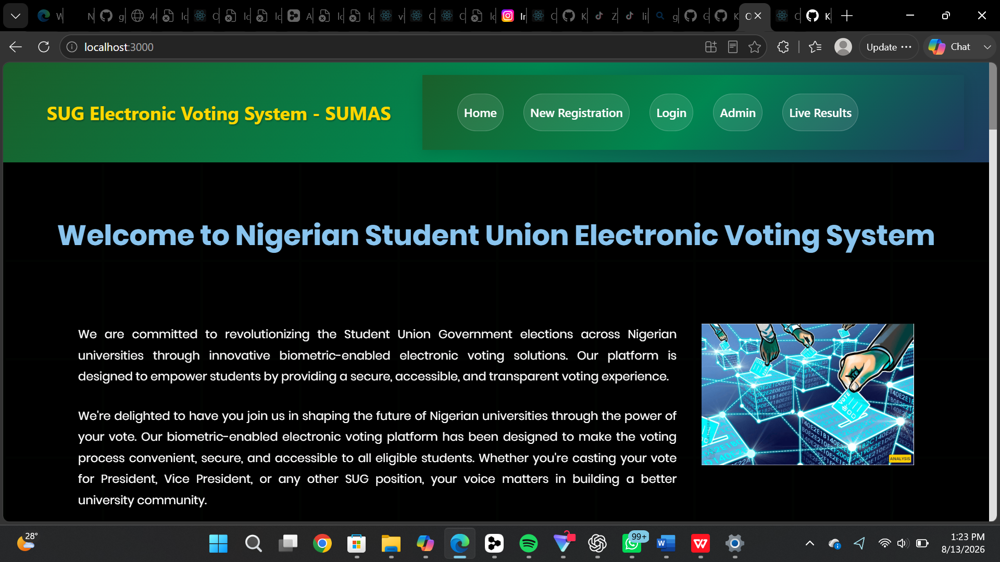
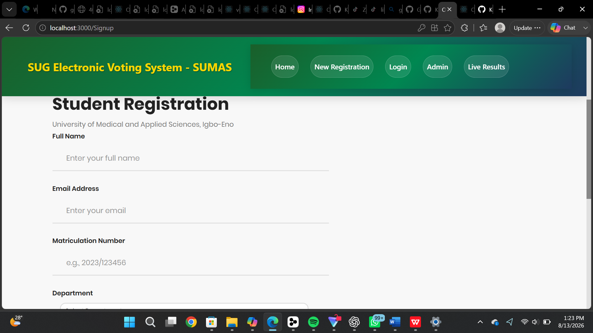
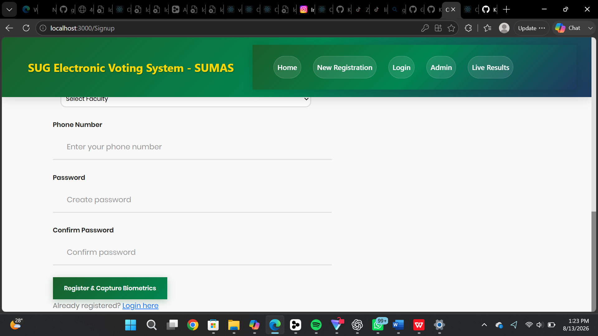
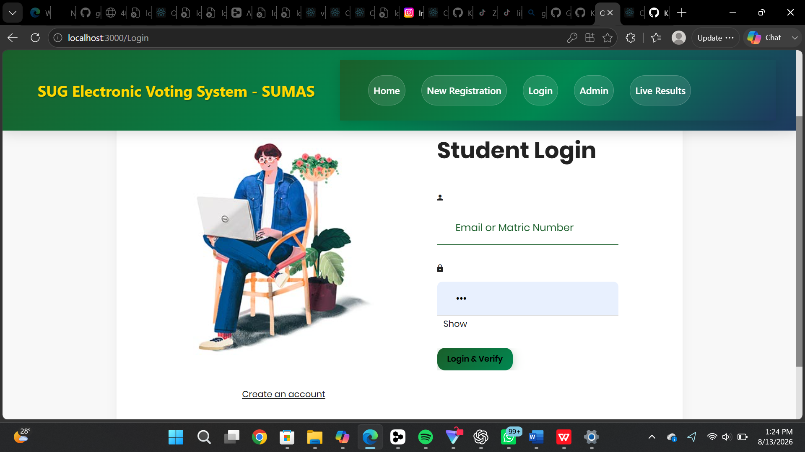
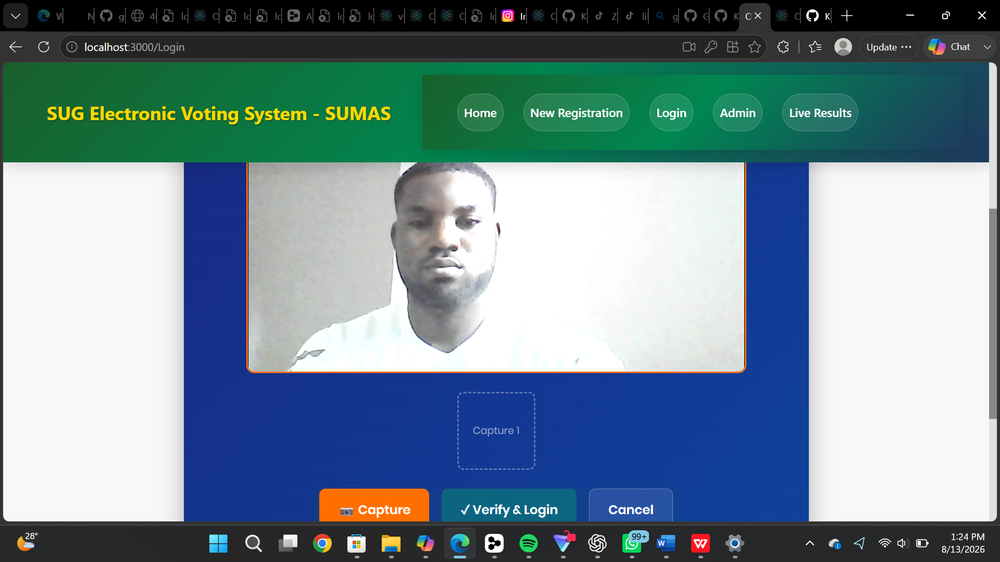
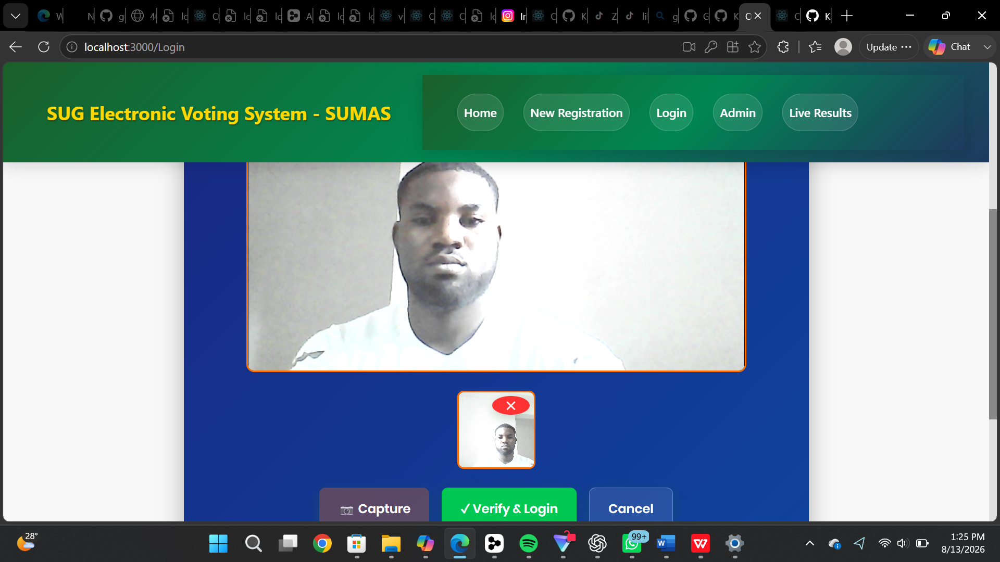
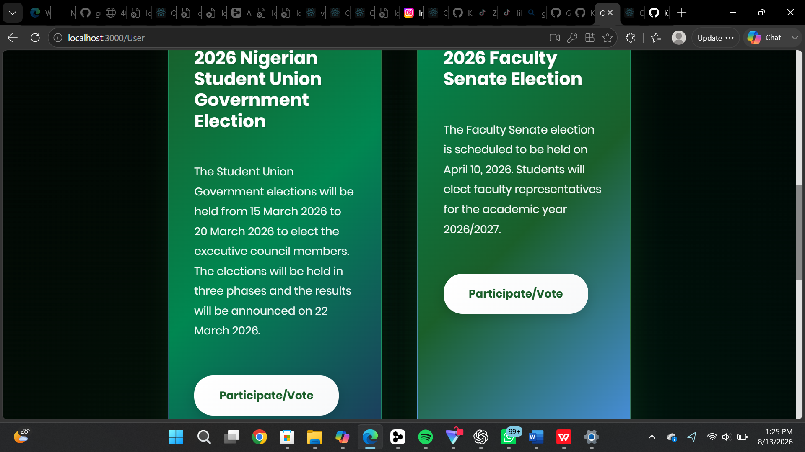
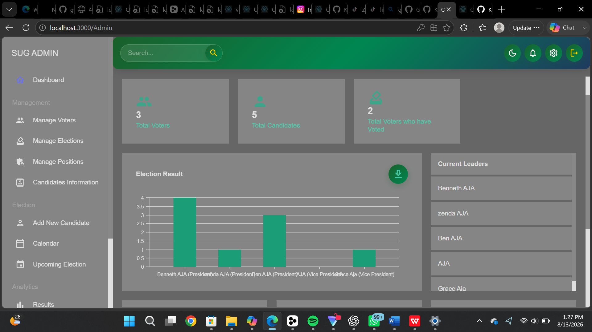
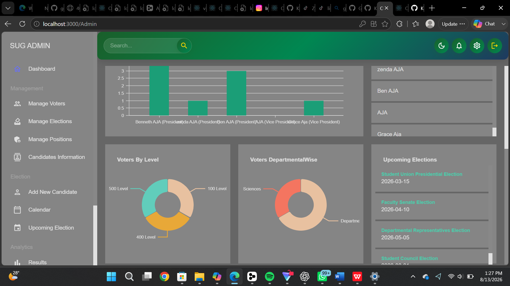
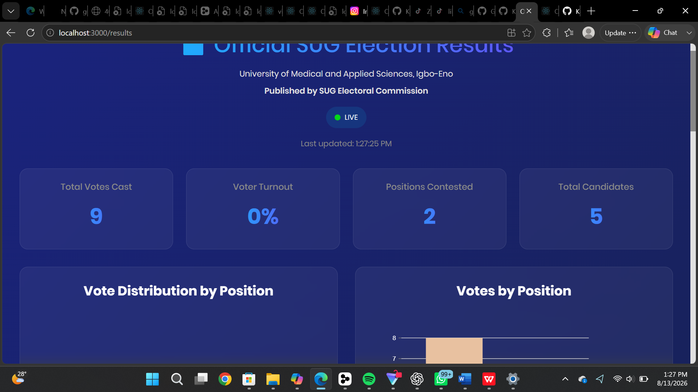

# SUMAS SUG Electronic Voting System

This repository contains the source code for the Student Union Government (SUG) Electronic Voting System developed for Summit University of Medical and Applied Sciences (SUMAS). The system is built using the MERN stack (MongoDB, Express.js, React.js, Node.js) and allows students to participate in SUG elections securely and efficiently.

## Features
- **User Authentication:** Secure user authentication and authorization system with biometric verification.
- **Student Registration:** Complete registration system for students with facial recognition data capture.
- **Voting Dashboard:** Interactive dashboard for students to view ongoing and upcoming SUG elections.
- **Voting Interface:** Intuitive interface for students to cast their votes for various SUG positions.
- **Admin Panel:** Comprehensive admin interface to create, manage, and monitor SUG elections.
- **Real-time Updates:** Real-time updates using Socket.io for instant notifications on voting results.
- **Data Security:** Implementation of security measures including JWT authentication and encrypted passwords.
- **Voter Analytics:** Admin dashboard with voter statistics by academic level and department.
- **Election Results:** Live results display with candidate information and vote counts.
- **Contact System:** Integrated contact form for reaching the SUG Electoral Commission.

## Technologies Used
- **Frontend:** React.js for building the user interface.
- **Backend:** Node.js and Express.js for server-side logic.
- **Database:** MongoDB for storing student data, elections, candidates, and results.
- **Authentication:** JSON Web Tokens (JWT) for secure authentication.
- **Real-time Updates:** Socket.io for real-time communication between clients and the server.
- **UI Framework:** Material-UI for designing responsive and modern UI components.
- **Biometric:** Face-api.js for facial recognition and biometric verification.

## Getting Started
To run the project locally, follow these steps:

1. Clone this repository to your local machine.
2. Navigate to the project directory.
3. Install dependencies for both the server and client:
  - npm install (for frontend React app)
  - cd server
  - npm install (for backend server)
  - cd ../ (back to root)

4. Configure environment variables:
The server already has a .env file configured with MongoDB connection.
For production, create a server/.env file with the following variables:
- JWT_SECRET (generate a secure random key)
- ADMIN_EMAIL (your admin email)
- ADMIN_PASSWORD (your admin password)
- MONGODB_URI (your MongoDB connection string)
- EMAIL_USER (your email for notifications)
- EMAIL_PASS (your email password/app password)

5. Start MongoDB:
Make sure MongoDB is running on your system or update the connection string in server/.env

6. Start the server (in one terminal):
cd server
npm start

7. Start the client (in another terminal):
cd ../ (back to root)
npm start

The application will be available at:
- Frontend: http://localhost:3000
- Backend API: http://localhost:5002

## Screenshots

### Home Page

### Student Registration

### Student Login

### User Dashboard

### Voting Interface

### Admin Dashboard

### Voter Analytics

### Election Results

### Team

## Project Structure
- `/src` - React frontend application
  - `/components` - React components (Home, Sign, User, NewDashboard)
  - `/components/NewDashboard` - Admin dashboard with Material-UI
  - `/components/Sign` - Authentication pages (Login, Signup, AdminLogin)
  - `/components/User` - Student user portal
  - `/components/Home` - Landing page sections
- `/server` - Node.js backend
  - `/models` - Mongoose schemas (Voter, Candidate, Election, Vote, AuditLog)
  - `/routes` - Express API routes
  - `/server.js` - Main server entry point

## SUG Elections Supported
- Student Union Presidential Election
- Faculty Senate Election
- Departmental Representatives Election
- Student Council Election

## Authors
- **Benneth Aja (Zenda)** - Lead Developer
- **Lilian Eze** - Co-Developer

## Contributing
Contributions are welcome! Please feel free to submit bug reports, feature requests, or pull requests.

- Fork the repository.
- Create a new branch (git checkout -b feature/fooBar).
- Commit your changes (git commit -am 'Add some fooBar').
- Push to the branch (git push origin feature/fooBar).
- Create a new Pull Request.

## License
This project is developed for Summit University of Medical and Applied Sciences (SUMAS) Student Union Government.
